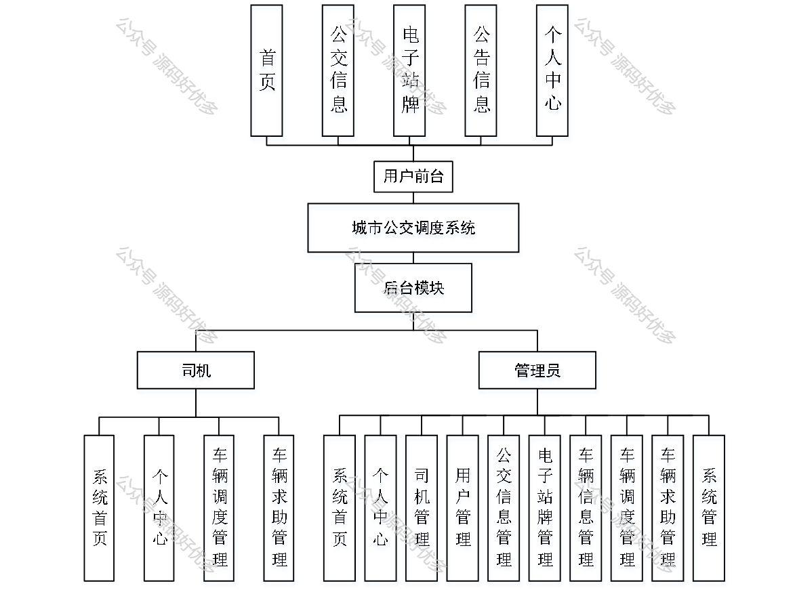
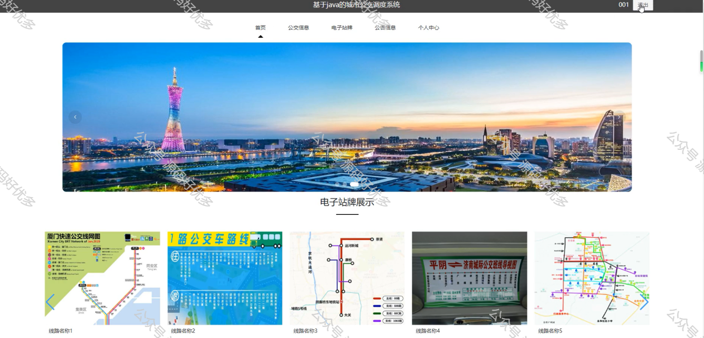
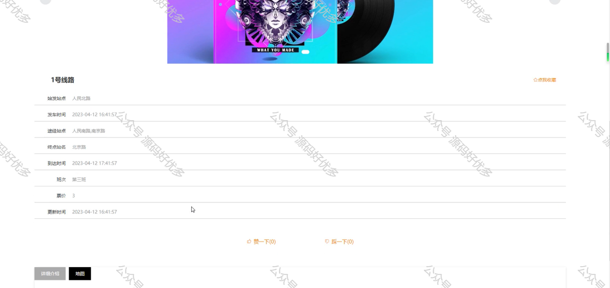
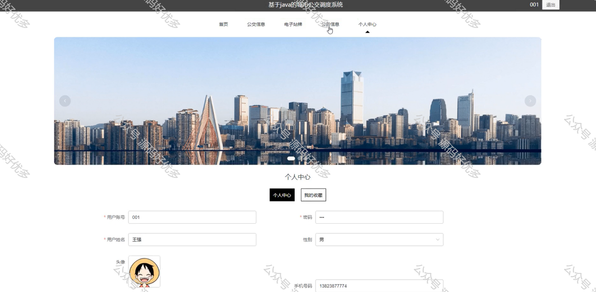
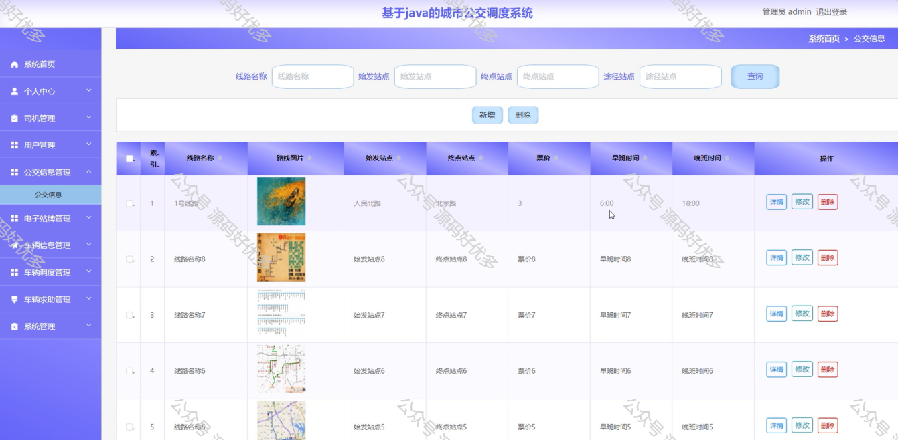
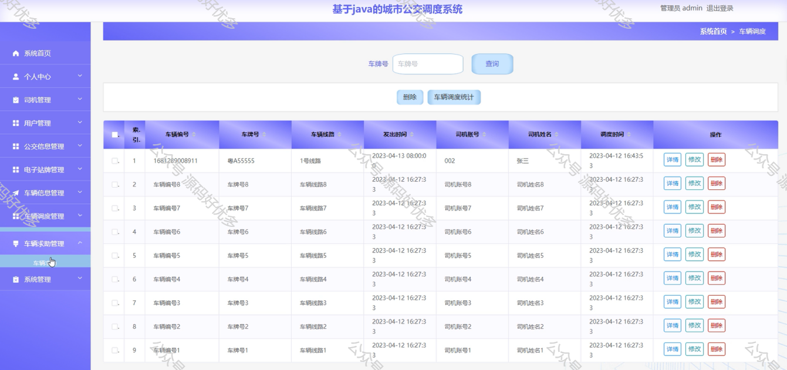
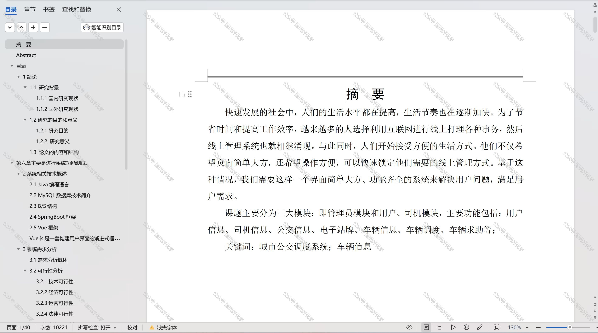

 
## 查看主页获取源码

### 一、作品包含

源码+数据库+设计文档万字+PPT+全套环境和工具资源+部署教程

### 二、项目技术

前端技术：Html、Css、Js、Vue、Element-ui

数据库：MySQL

后端技术：Java、Spring Boot、MyBatis

  

### 三、运行环境

开发工具：IDEA/eclipse

数据库：MySQL5.7

数据库管理工具：Navicat10以上版本

环境配置软件： JDK1.8+Maven3.6.3

前端Nodejs：14

### 四、项目介绍
项目编号：springbootA246

城市公交调度系统是城市公共交通管理的重要组成部分，它通过优化公交车辆的运行路线和时间安排，提高公交服务的效率和质量。随着城市规模的不断扩大和公共交通需求的日益增长，公交调度系统在城市交通管理中的作用日益凸显，它有助于缓解交通拥堵、减少空气污染，并为市民提供更加便捷、舒适的出行体验。

前台用户功能：首页、公交信息、电子站牌、公告信息和个人信息。

后台分为管理员和司机
管理员的功能：系统首页、个人中心、司机管理、用户管理、公交信息管理、电子站牌管理、车辆信息管理、车辆调度管理、车辆求助管理和系统管理。
司机的功能：系统首页、个人中心、车辆调度管理、车辆求助管理。

### 五、运行截图

  
